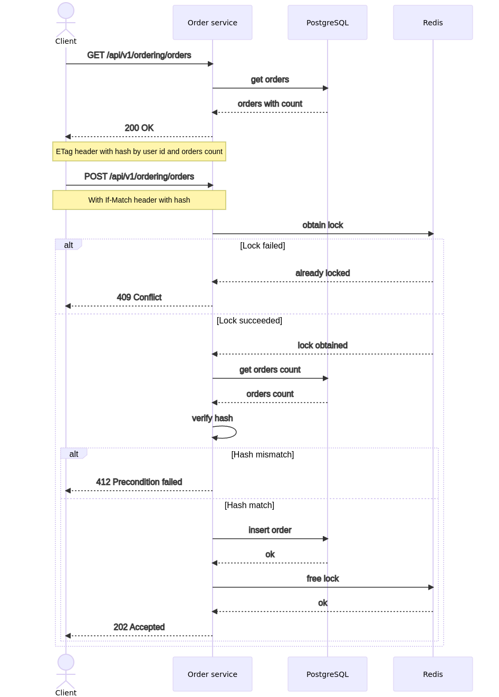

# Otus Microservice architecture Homework 7

## Домашнее задание выполнено для курса ["Microservice architecture"](https://otus.ru/lessons/microservice-architecture/)

### Реализация идемпотентности метода заказа

В рамках задания добавлена идемпотентность для метода создания заказа `POST /api/v1/ordering/orders` на основе использования тега коллекции [`ETag`](https://developer.mozilla.org/ru/docs/Web/HTTP/Headers/ETag). Дополнительно, для обеспечения разрешения гонок (если запрос на создание заказа отправлен дважды за короткое время) добавлена эксклюзивная блокировка с использованием Redis.

Алгоритм работы.

[](https://mermaid.live/view/#pako:eNqNVE1vwjAM_StWziAY2mU9IE0MbdM-YGPSLr1kidtaaxOWpEwI8d-XklZrYcByqGL72c96drNhQktkEbP4VaISeEM8NbyIFfjDhdMGJjmhcsETvsHTH49nRqIBi2ZFAiO4nb7BgC9psLoY6CpEKg0XGxI7eJ8_19alBhcvjxGk6KCN_Y31D5kCEL7JZSB02bTXre_TQqcRjIZDmD0E0LN2CHrlgR14Dxrw9I2nkCGvgjuGjNsMPtZQeiiQBK5k00GL_Jgq89nijCxnO3qvurhP-k_cieygtb-1fUVJ1iv14TgpyLX4rIeaO3j0FiSccpTBWZ1dwh9a89x4wvWuRBt_VOzL4RVMtEpyErU0mFsMpLYUAlH-h7fiq9s_Tntsh9qD-e827aXsE-0l-XFRsm4NoBH3rtqWgmxRDes3dFqyixHMDQqtJDnS6mA4OwVD5XNlu5KQ8v5alW7WaUk-T1PU25UYxNZunRvp6aqd_3UE135Tlq4jgqoNf2E9VqApOEn_em0qd8xchgXGLPJXiQkvcxezWG09tFxK7nDqxdWGRc6U2GO8dHqxVqKxA6Z-AINz-wM_mKf0)

### Запуск приложения

```shell
# запуск minikube
# версия k8s v1.19, на более поздних есть проблемы с установкой ambassador
minikube start --cpus=6 --memory=16g --disk-size='40000mb' --vm-driver=virtualbox --cni=flannel --kubernetes-version="v1.19.0"

kubectl create namespace otus
kubectl config set-context --current --namespace=otus

# установка Ambassador
helm install aes datawire/ambassador -f deploy/ambassador-values.yaml

# установка Apache Kafka
helm install kafka bitnami/kafka -f deploy/kafka-values.yaml

## запуск проекта
helm install --wait -f deploy/identity-values.yaml identity-service ./services/identity-service/deployments/identity-service --atomic
helm install --wait -f deploy/billing-values.yaml billing-service ./services/billing-service/deployments/billing-service --atomic
helm install --wait -f deploy/order-values.yaml order-service ./services/order-service/deployments/order-service --atomic
helm install --wait -f deploy/notification-values.yaml notification-service ./services/notification-service/deployments/notification-service --atomic

# применение настроек ambassador
kubectl apply -f services/ambassador/
```

### Тестирование

Тесты Postman расположены в директории `test/postman`. Запуск тестов.

```bash
newman run ./test/postman/test_idempotence.postman_collection.json
```

Или с использованием Docker.

```bash
docker run -v $PWD/test/postman/:/etc/newman --network host -t postman/newman:alpine run test_idempotence.postman_collection.json
```

Дополнительно, для проверки ситуации гонок написаны тесты на Go

```shell
cd test
go test ./racetest/race_test.go
```

### Отладка

```shell
# отладка kafka consumer
kubectl run kafka-client --restart='Never' --image docker.io/bitnami/kafka:2.8.1-debian-10-r73 --namespace otus --command -- sleep infinity
kubectl exec --tty -i kafka-client --namespace otus -- bash
kafka-console-consumer.sh \
    --bootstrap-server kafka.otus.svc.cluster.local:9092 \
    --topic <TOPIC_NAME> \
    --property print.headers=true \
    --from-beginning
    
# отладка postgres
kubectl port-forward svc/identity-service-postgresql 5432:5432
```
