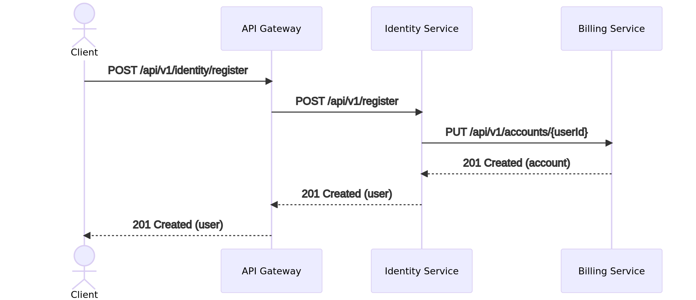
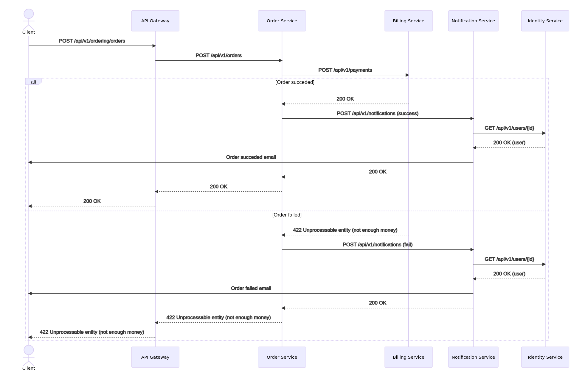
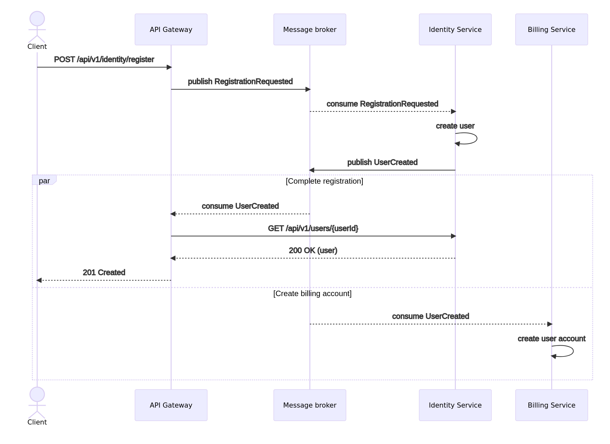
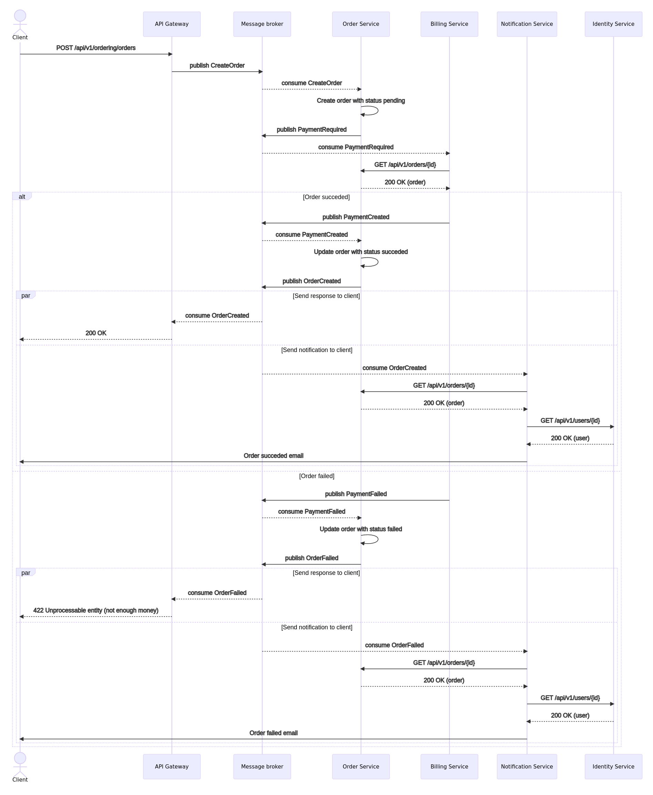
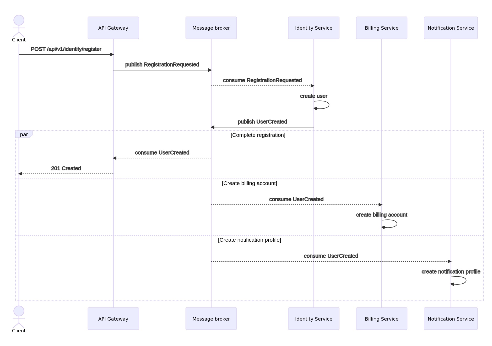
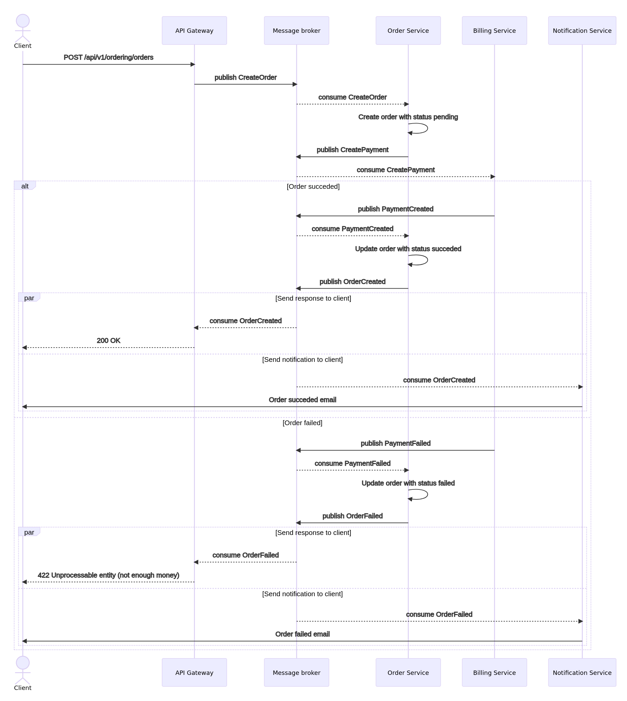
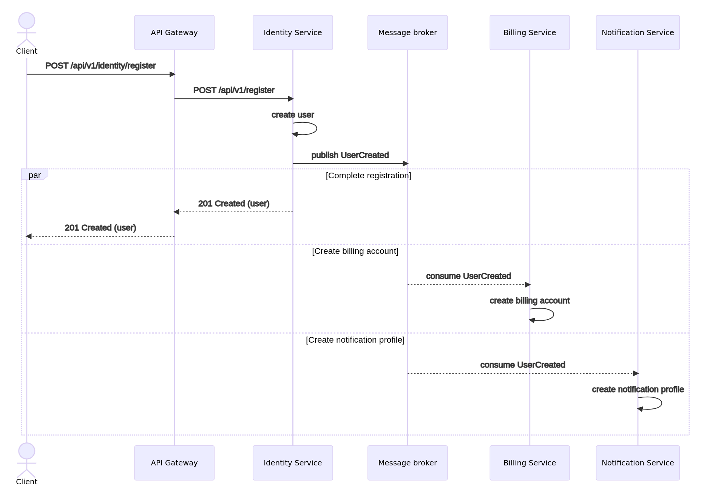
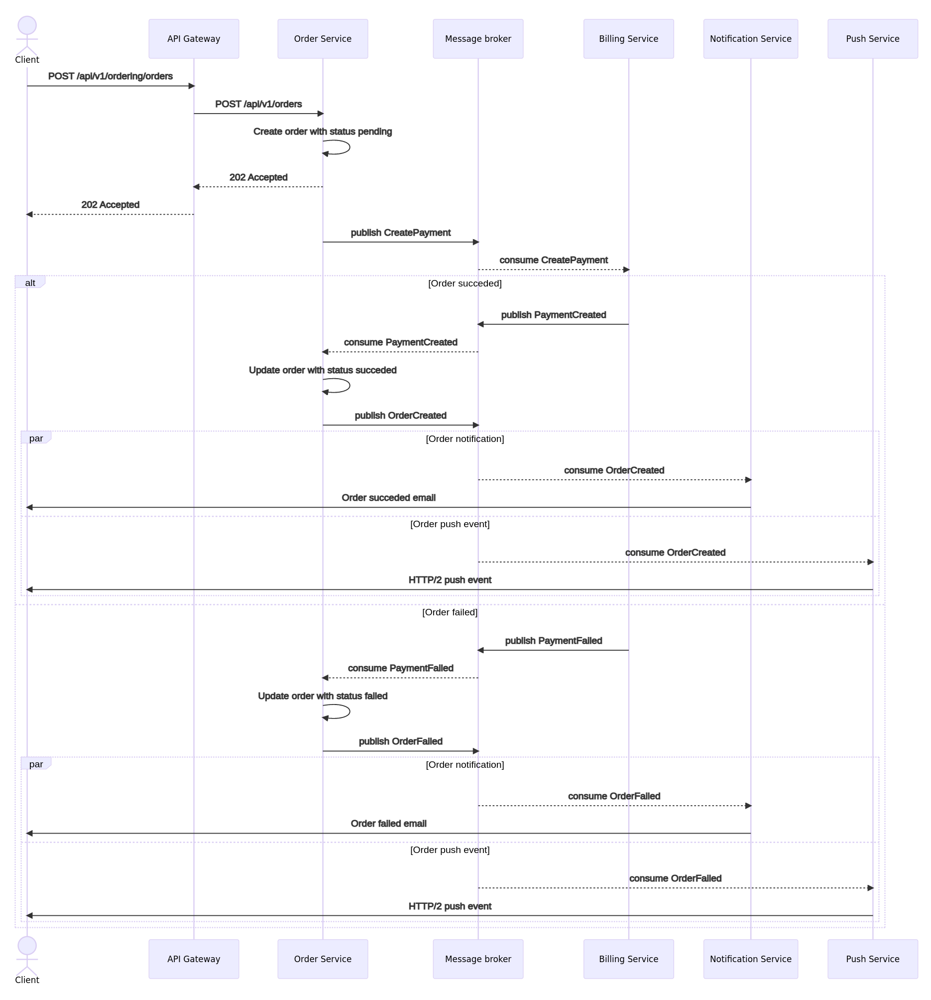

# Варианты реализации системы заказов

[Спецификация публичного REST API](http://petstore.swagger.io/?url=https%3A%2F%2Fraw.githubusercontent.com%2Fstrider2038%2Fotus-micro-5%2Fmain%2Fdocs%2Fpublic-api.yaml)

## 1. Взаимодействие через HTTP

### Спецификации

* [Спецификация REST API сервисов](http://petstore.swagger.io/?url=https%3A%2F%2Fraw.githubusercontent.com%2Fstrider2038%2Fotus-micro-5%2Fmain%2Fdocs%2F1_http%2Frest-api.yaml)

### Регистрация пользователя

[](https://mermaid.live/view/#eyJjb2RlIjoic2VxdWVuY2VEaWFncmFtXG4gICAgYWN0b3IgQ2xpZW50XG4gICAgXG4gICAgQ2xpZW50LT4-QVBJIEdhdGV3YXk6IFBPU1QgL2FwaS92MS9pZGVudGl0eS9yZWdpc3RlclxuICAgIEFQSSBHYXRld2F5LT4-SWRlbnRpdHkgU2VydmljZTogUE9TVCAvYXBpL3YxL3JlZ2lzdGVyXG4gICAgSWRlbnRpdHkgU2VydmljZS0-PkJpbGxpbmcgU2VydmljZTogUFVUIC9hcGkvdjEvYWNjb3VudHMve3VzZXJJZH1cbiAgICBCaWxsaW5nIFNlcnZpY2UtLT4-SWRlbnRpdHkgU2VydmljZTogMjAxIENyZWF0ZWQgKGFjY291bnQpXG4gICAgSWRlbnRpdHkgU2VydmljZS0tPj5BUEkgR2F0ZXdheTogMjAxIENyZWF0ZWQgKHVzZXIpXG4gICAgQVBJIEdhdGV3YXktLT4-Q2xpZW50OiAyMDEgQ3JlYXRlZCAodXNlcikiLCJtZXJtYWlkIjoie1xuICBcInRoZW1lXCI6IFwiZGVmYXVsdFwiXG59IiwidXBkYXRlRWRpdG9yIjp0cnVlLCJhdXRvU3luYyI6dHJ1ZSwidXBkYXRlRGlhZ3JhbSI6dHJ1ZX0)

### Создание заказа

[](https://mermaid.live/view/#eyJjb2RlIjoic2VxdWVuY2VEaWFncmFtXG4gICAgYWN0b3IgQ2xpZW50XG4gICAgXG4gICAgQ2xpZW50LT4-QVBJIEdhdGV3YXk6IFBPU1QgL2FwaS92MS9vcmRlcmluZy9vcmRlcnNcbiAgICBBUEkgR2F0ZXdheS0-Pk9yZGVyIFNlcnZpY2U6IFBPU1QgL2FwaS92MS9vcmRlcnNcbiAgICBPcmRlciBTZXJ2aWNlLT4-QmlsbGluZyBTZXJ2aWNlOiBQT1NUIC9hcGkvdjEvcGF5bWVudHNcbiAgICBcbiAgICBhbHQgT3JkZXIgc3VjY2VkZWRcbiAgICAgICAgQmlsbGluZyBTZXJ2aWNlLS0-Pk9yZGVyIFNlcnZpY2U6IDIwMCBPS1xuICAgICAgICBPcmRlciBTZXJ2aWNlLT4-Tm90aWZpY2F0aW9uIFNlcnZpY2U6IFBPU1QgL2FwaS92MS9ub3RpZmljYXRpb25zIChzdWNjZXNzKVxuICAgICAgICBOb3RpZmljYXRpb24gU2VydmljZS0-PklkZW50aXR5IFNlcnZpY2U6IEdFVCAvYXBpL3YxL3VzZXJzL3tpZH1cbiAgICAgICAgSWRlbnRpdHkgU2VydmljZS0tPj5Ob3RpZmljYXRpb24gU2VydmljZTogMjAwIE9LICh1c2VyKVxuICAgICAgICBOb3RpZmljYXRpb24gU2VydmljZS0-PkNsaWVudDogT3JkZXIgc3VjY2VkZWQgZW1haWxcbiAgICAgICAgTm90aWZpY2F0aW9uIFNlcnZpY2UtLT4-T3JkZXIgU2VydmljZTogMjAwIE9LXG4gICAgICAgIE9yZGVyIFNlcnZpY2UtLT4-QVBJIEdhdGV3YXk6IDIwMCBPS1xuICAgICAgICBBUEkgR2F0ZXdheS0tPj5DbGllbnQ6IDIwMCBPS1xuICAgIGVsc2UgT3JkZXIgZmFpbGVkXG4gICAgICAgIEJpbGxpbmcgU2VydmljZS0tPj5PcmRlciBTZXJ2aWNlOiA0MjIgVW5wcm9jZXNzYWJsZSBlbnRpdHkgKG5vdCBlbm91Z2ggbW9uZXkpXG4gICAgICAgIE9yZGVyIFNlcnZpY2UtPj5Ob3RpZmljYXRpb24gU2VydmljZTogUE9TVCAvYXBpL3YxL25vdGlmaWNhdGlvbnMgKGZhaWwpXG4gICAgICAgIE5vdGlmaWNhdGlvbiBTZXJ2aWNlLT4-SWRlbnRpdHkgU2VydmljZTogR0VUIC9hcGkvdjEvdXNlcnMve2lkfVxuICAgICAgICBJZGVudGl0eSBTZXJ2aWNlLS0-Pk5vdGlmaWNhdGlvbiBTZXJ2aWNlOiAyMDAgT0sgKHVzZXIpXG4gICAgICAgIE5vdGlmaWNhdGlvbiBTZXJ2aWNlLT4-Q2xpZW50OiBPcmRlciBmYWlsZWQgZW1haWxcbiAgICAgICAgTm90aWZpY2F0aW9uIFNlcnZpY2UtLT4-T3JkZXIgU2VydmljZTogMjAwIE9LXG4gICAgICAgIE9yZGVyIFNlcnZpY2UtLT4-QVBJIEdhdGV3YXk6IDQyMiBVbnByb2Nlc3NhYmxlIGVudGl0eSAobm90IGVub3VnaCBtb25leSlcbiAgICAgICAgQVBJIEdhdGV3YXktLT4-Q2xpZW50OiA0MjIgVW5wcm9jZXNzYWJsZSBlbnRpdHkgKG5vdCBlbm91Z2ggbW9uZXkpXG4gICAgZW5kIiwibWVybWFpZCI6IntcbiAgXCJ0aGVtZVwiOiBcImRlZmF1bHRcIlxufSIsInVwZGF0ZUVkaXRvciI6dHJ1ZSwiYXV0b1N5bmMiOnRydWUsInVwZGF0ZURpYWdyYW0iOnRydWV9)

### Выводы

Достоинства:

* простота реализации;
* пользователь узнает о результате операции сразу (синхронное взаимодействие).

Недостатки:

* большое время ответа из-за синхронного взаимодействия между сервисами;
* асинхронные операции (отправка уведомлений) выполняются синхронно;
* необходим механизм оркестрации из-за распределенности обработки.

## 2. Событийные взаимодействия

### Спецификации

* [Спецификация REST API сервисов](http://petstore.swagger.io/?url=https%3A%2F%2Fraw.githubusercontent.com%2Fstrider2038%2Fotus-micro-5%2Fmain%2Fdocs%2F2_events%2Frest-api.yaml)
* [Спецификация Async API сервисов](2_events/async-api.yaml)

### Регистрация пользователя

[](https://mermaid.live/view/#eyJjb2RlIjoic2VxdWVuY2VEaWFncmFtXG4gICAgYWN0b3IgQ2xpZW50XG4gICAgXG4gICAgQ2xpZW50LT4-QVBJIEdhdGV3YXk6IFBPU1QgL2FwaS92MS9pZGVudGl0eS9yZWdpc3RlclxuICAgIEFQSSBHYXRld2F5LT4-TWVzc2FnZSBicm9rZXI6IHB1Ymxpc2ggUmVnaXN0cmF0aW9uUmVxdWVzdGVkXG4gICAgTWVzc2FnZSBicm9rZXItLT4-SWRlbnRpdHkgU2VydmljZTogY29uc3VtZSBSZWdpc3RyYXRpb25SZXF1ZXN0ZWRcbiAgICBJZGVudGl0eSBTZXJ2aWNlLT4-SWRlbnRpdHkgU2VydmljZTogY3JlYXRlIHVzZXJcbiAgICBJZGVudGl0eSBTZXJ2aWNlLT4-TWVzc2FnZSBicm9rZXI6IHB1Ymxpc2ggVXNlckNyZWF0ZWQgXG4gICAgXG4gICAgcGFyIENvbXBsZXRlIHJlZ2lzdHJhdGlvblxuICAgICAgICBNZXNzYWdlIGJyb2tlci0tPj5BUEkgR2F0ZXdheTogY29uc3VtZSBVc2VyQ3JlYXRlZFxuICAgICAgICBBUEkgR2F0ZXdheS0-PklkZW50aXR5IFNlcnZpY2U6IEdFVCAvYXBpL3YxL3VzZXJzL3t1c2VySWR9XG4gICAgICAgIElkZW50aXR5IFNlcnZpY2UtLT4-QVBJIEdhdGV3YXk6IDIwMCBPSyAodXNlcilcbiAgICAgICAgQVBJIEdhdGV3YXktLT4-Q2xpZW50OiAyMDEgQ3JlYXRlZFxuICAgIGFuZCBDcmVhdGUgYmlsbGluZyBhY2NvdW50XG4gICAgICAgIE1lc3NhZ2UgYnJva2VyLS0-PkJpbGxpbmcgU2VydmljZTogY29uc3VtZSBVc2VyQ3JlYXRlZFxuICAgICAgICBCaWxsaW5nIFNlcnZpY2UtPj5CaWxsaW5nIFNlcnZpY2U6IGNyZWF0ZSB1c2VyIGFjY291bnRcbiAgICBlbmQiLCJtZXJtYWlkIjoie1xuICBcInRoZW1lXCI6IFwiZGVmYXVsdFwiXG59IiwidXBkYXRlRWRpdG9yIjp0cnVlLCJhdXRvU3luYyI6dHJ1ZSwidXBkYXRlRGlhZ3JhbSI6dHJ1ZX0)

### Создание заказа

[](https://mermaid.live/view/#eyJjb2RlIjoic2VxdWVuY2VEaWFncmFtXG4gICAgYWN0b3IgQ2xpZW50XG4gICAgXG4gICAgQ2xpZW50LT4-QVBJIEdhdGV3YXk6IFBPU1QgL2FwaS92MS9vcmRlcmluZy9vcmRlcnNcbiAgICBBUEkgR2F0ZXdheS0-Pk1lc3NhZ2UgYnJva2VyOiBwdWJsaXNoIENyZWF0ZU9yZGVyXG4gICAgTWVzc2FnZSBicm9rZXItLT4-T3JkZXIgU2VydmljZTogY29uc3VtZSBDcmVhdGVPcmRlclxuICAgIE9yZGVyIFNlcnZpY2UtPj5PcmRlciBTZXJ2aWNlOiBDcmVhdGUgb3JkZXIgd2l0aCBzdGF0dXMgcGVuZGluZ1xuICAgIE9yZGVyIFNlcnZpY2UtPj5NZXNzYWdlIGJyb2tlcjogcHVibGlzaCBQYXltZW50UmVxdWlyZWRcbiAgICBNZXNzYWdlIGJyb2tlci0tPj5CaWxsaW5nIFNlcnZpY2U6IGNvbnN1bWUgUGF5bWVudFJlcXVpcmVkXG4gICAgQmlsbGluZyBTZXJ2aWNlLT4-T3JkZXIgU2VydmljZTogR0VUIC9hcGkvdjEvb3JkZXJzL3tpZH1cbiAgICBPcmRlciBTZXJ2aWNlLS0-PkJpbGxpbmcgU2VydmljZTogMjAwIE9LIChvcmRlcilcbiAgICBcbiAgICBhbHQgT3JkZXIgc3VjY2VkZWRcbiAgICAgICAgQmlsbGluZyBTZXJ2aWNlLT4-TWVzc2FnZSBicm9rZXI6IHB1Ymxpc2ggUGF5bWVudENyZWF0ZWRcbiAgICAgICAgTWVzc2FnZSBicm9rZXItLT4-T3JkZXIgU2VydmljZTogY29uc3VtZSBQYXltZW50Q3JlYXRlZFxuICAgICAgICBPcmRlciBTZXJ2aWNlLT4-T3JkZXIgU2VydmljZTogVXBkYXRlIG9yZGVyIHdpdGggc3RhdHVzIHN1Y2NlZGVkXG4gICAgICAgIE9yZGVyIFNlcnZpY2UtPj5NZXNzYWdlIGJyb2tlcjogcHVibGlzaCBPcmRlckNyZWF0ZWRcbiAgICAgICAgcGFyIFNlbmQgcmVzcG9uc2UgdG8gY2xpZW50XG4gICAgICAgICAgICBNZXNzYWdlIGJyb2tlci0tPj5BUEkgR2F0ZXdheTogY29uc3VtZSBPcmRlckNyZWF0ZWRcbiAgICAgICAgICAgIEFQSSBHYXRld2F5LS0-PkNsaWVudDogMjAwIE9LXG4gICAgICAgIGFuZCBTZW5kIG5vdGlmaWNhdGlvbiB0byBjbGllbnRcbiAgICAgICAgICAgIE1lc3NhZ2UgYnJva2VyLS0-Pk5vdGlmaWNhdGlvbiBTZXJ2aWNlOiBjb25zdW1lIE9yZGVyQ3JlYXRlZFxuICAgICAgICAgICAgTm90aWZpY2F0aW9uIFNlcnZpY2UtPj5PcmRlciBTZXJ2aWNlOiBHRVQgL2FwaS92MS9vcmRlcnMve2lkfVxuICAgICAgICAgICAgT3JkZXIgU2VydmljZS0tPj5Ob3RpZmljYXRpb24gU2VydmljZTogMjAwIE9LIChvcmRlcilcbiAgICAgICAgICAgIE5vdGlmaWNhdGlvbiBTZXJ2aWNlLT4-SWRlbnRpdHkgU2VydmljZTogR0VUIC9hcGkvdjEvdXNlcnMve2lkfVxuICAgICAgICAgICAgSWRlbnRpdHkgU2VydmljZS0tPj5Ob3RpZmljYXRpb24gU2VydmljZTogMjAwIE9LICh1c2VyKVxuICAgICAgICAgICAgTm90aWZpY2F0aW9uIFNlcnZpY2UtPj5DbGllbnQ6IE9yZGVyIHN1Y2NlZGVkIGVtYWlsXG4gICAgICAgIGVuZFxuICAgIGVsc2UgT3JkZXIgZmFpbGVkXG4gICAgICAgIEJpbGxpbmcgU2VydmljZS0-Pk1lc3NhZ2UgYnJva2VyOiBwdWJsaXNoIFBheW1lbnRGYWlsZWRcbiAgICAgICAgTWVzc2FnZSBicm9rZXItLT4-T3JkZXIgU2VydmljZTogY29uc3VtZSBQYXltZW50RmFpbGVkXG4gICAgICAgIE9yZGVyIFNlcnZpY2UtPj5PcmRlciBTZXJ2aWNlOiBVcGRhdGUgb3JkZXIgd2l0aCBzdGF0dXMgZmFpbGVkXG4gICAgICAgIE9yZGVyIFNlcnZpY2UtPj5NZXNzYWdlIGJyb2tlcjogcHVibGlzaCBPcmRlckZhaWxlZFxuICAgICAgICBwYXIgU2VuZCByZXNwb25zZSB0byBjbGllbnRcbiAgICAgICAgICAgIE1lc3NhZ2UgYnJva2VyLS0-PkFQSSBHYXRld2F5OiBjb25zdW1lIE9yZGVyRmFpbGVkXG4gICAgICAgICAgICBBUEkgR2F0ZXdheS0tPj5DbGllbnQ6IDQyMiBVbnByb2Nlc3NhYmxlIGVudGl0eSAobm90IGVub3VnaCBtb25leSlcbiAgICAgICAgYW5kIFNlbmQgbm90aWZpY2F0aW9uIHRvIGNsaWVudFxuICAgICAgICAgICAgTWVzc2FnZSBicm9rZXItLT4-Tm90aWZpY2F0aW9uIFNlcnZpY2U6IGNvbnN1bWUgT3JkZXJGYWlsZWRcbiAgICAgICAgICAgIE5vdGlmaWNhdGlvbiBTZXJ2aWNlLT4-T3JkZXIgU2VydmljZTogR0VUIC9hcGkvdjEvb3JkZXJzL3tpZH1cbiAgICAgICAgICAgIE9yZGVyIFNlcnZpY2UtLT4-Tm90aWZpY2F0aW9uIFNlcnZpY2U6IDIwMCBPSyAob3JkZXIpXG4gICAgICAgICAgICBOb3RpZmljYXRpb24gU2VydmljZS0-PklkZW50aXR5IFNlcnZpY2U6IEdFVCAvYXBpL3YxL3VzZXJzL3tpZH1cbiAgICAgICAgICAgIElkZW50aXR5IFNlcnZpY2UtLT4-Tm90aWZpY2F0aW9uIFNlcnZpY2U6IDIwMCBPSyAodXNlcilcbiAgICAgICAgICAgIE5vdGlmaWNhdGlvbiBTZXJ2aWNlLT4-Q2xpZW50OiBPcmRlciBmYWlsZWQgZW1haWxcbiAgICAgICAgZW5kXG4gICAgZW5kIiwibWVybWFpZCI6IntcbiAgXCJ0aGVtZVwiOiBcImRlZmF1bHRcIlxufSIsInVwZGF0ZUVkaXRvciI6dHJ1ZSwiYXV0b1N5bmMiOnRydWUsInVwZGF0ZURpYWdyYW0iOnRydWV9)

### Выводы

Достоинства:

* service discovery на основе брокера сообщений => легче масштабирование;
* создание аккаунта в биллинге осуществляется асинхронно;
* отправка уведомлений осуществляется асинхронно (параллельно с ответом в API Gateway).

Недостатки:

* повышенная сложность реализации:
    * логика работы с брокером в API Gateway;
    * присутствуют синхронные запросы между сервисами;
    * API Gateway должен хранить состояние (correlationId).
* дополнительная связность между сервисами (биллинг обращается к заказам);
* увеличенное время ответа из-за дополнительного взаимодействия через брокер сообщений;
* проблемы асинхронного создания аккаунта в биллинге:
    * может возникнуть проблема отсутствия аккаунта в случае сбоя;
    * критично время выполнения события (аккаунта еще может не быть, когда он уже может быть нужен - маловероятно, но возможно).

## 3. Event collaboration

### Спецификации

* [Спецификация REST API сервисов](http://petstore.swagger.io/?url=https%3A%2F%2Fraw.githubusercontent.com%2Fstrider2038%2Fotus-micro-5%2Fmain%2Fdocs%2F3_event-collaboration%2Frest-api.yaml)
* [Спецификация Async API сервисов](3_event-collaboration/async-api.yaml)

### Регистрация пользователя

[](https://mermaid.live/view/#eyJjb2RlIjoic2VxdWVuY2VEaWFncmFtXG4gICAgYWN0b3IgQ2xpZW50XG4gICAgXG4gICAgQ2xpZW50LT4-QVBJIEdhdGV3YXk6IFBPU1QgL2FwaS92MS9pZGVudGl0eS9yZWdpc3RlclxuICAgIEFQSSBHYXRld2F5LT4-TWVzc2FnZSBicm9rZXI6IHB1Ymxpc2ggUmVnaXN0cmF0aW9uUmVxdWVzdGVkXG4gICAgTWVzc2FnZSBicm9rZXItLT4-SWRlbnRpdHkgU2VydmljZTogY29uc3VtZSBSZWdpc3RyYXRpb25SZXF1ZXN0ZWRcbiAgICBJZGVudGl0eSBTZXJ2aWNlLT4-SWRlbnRpdHkgU2VydmljZTogY3JlYXRlIHVzZXJcbiAgICBJZGVudGl0eSBTZXJ2aWNlLT4-TWVzc2FnZSBicm9rZXI6IHB1Ymxpc2ggVXNlckNyZWF0ZWQgXG4gICAgXG4gICAgcGFyIENvbXBsZXRlIHJlZ2lzdHJhdGlvblxuICAgICAgICBNZXNzYWdlIGJyb2tlci0tPj5BUEkgR2F0ZXdheTogY29uc3VtZSBVc2VyQ3JlYXRlZFxuICAgICAgICBBUEkgR2F0ZXdheS0tPj5DbGllbnQ6IDIwMSBDcmVhdGVkXG4gICAgYW5kIENyZWF0ZSBiaWxsaW5nIGFjY291bnRcbiAgICAgICAgTWVzc2FnZSBicm9rZXItLT4-QmlsbGluZyBTZXJ2aWNlOiBjb25zdW1lIFVzZXJDcmVhdGVkXG4gICAgICAgIEJpbGxpbmcgU2VydmljZS0-PkJpbGxpbmcgU2VydmljZTogY3JlYXRlIGJpbGxpbmcgYWNjb3VudFxuICAgIGFuZCBDcmVhdGUgbm90aWZpY2F0aW9uIHByb2ZpbGVcbiAgICAgICAgTWVzc2FnZSBicm9rZXItLT4-Tm90aWZpY2F0aW9uIFNlcnZpY2U6IGNvbnN1bWUgVXNlckNyZWF0ZWRcbiAgICAgICAgTm90aWZpY2F0aW9uIFNlcnZpY2UtPj5Ob3RpZmljYXRpb24gU2VydmljZTogY3JlYXRlIG5vdGlmaWNhdGlvbiBwcm9maWxlXG4gICAgZW5kIiwibWVybWFpZCI6IntcbiAgXCJ0aGVtZVwiOiBcImRlZmF1bHRcIlxufSIsInVwZGF0ZUVkaXRvciI6dHJ1ZSwiYXV0b1N5bmMiOnRydWUsInVwZGF0ZURpYWdyYW0iOnRydWV9)

### Создание заказа

[](https://mermaid.live/view/#eyJjb2RlIjoic2VxdWVuY2VEaWFncmFtXG4gICAgYWN0b3IgQ2xpZW50XG4gICAgXG4gICAgQ2xpZW50LT4-QVBJIEdhdGV3YXk6IFBPU1QgL2FwaS92MS9vcmRlcmluZy9vcmRlcnNcbiAgICBBUEkgR2F0ZXdheS0-Pk1lc3NhZ2UgYnJva2VyOiBwdWJsaXNoIENyZWF0ZU9yZGVyXG4gICAgTWVzc2FnZSBicm9rZXItLT4-T3JkZXIgU2VydmljZTogY29uc3VtZSBDcmVhdGVPcmRlclxuICAgIE9yZGVyIFNlcnZpY2UtPj5PcmRlciBTZXJ2aWNlOiBDcmVhdGUgb3JkZXIgd2l0aCBzdGF0dXMgcGVuZGluZ1xuICAgIE9yZGVyIFNlcnZpY2UtPj5NZXNzYWdlIGJyb2tlcjogcHVibGlzaCBDcmVhdGVQYXltZW50XG4gICAgTWVzc2FnZSBicm9rZXItLT4-QmlsbGluZyBTZXJ2aWNlOiBjb25zdW1lIENyZWF0ZVBheW1lbnRcbiAgICBcbiAgICBhbHQgT3JkZXIgc3VjY2VkZWRcbiAgICAgICAgQmlsbGluZyBTZXJ2aWNlLT4-TWVzc2FnZSBicm9rZXI6IHB1Ymxpc2ggUGF5bWVudENyZWF0ZWRcbiAgICAgICAgTWVzc2FnZSBicm9rZXItLT4-T3JkZXIgU2VydmljZTogY29uc3VtZSBQYXltZW50Q3JlYXRlZFxuICAgICAgICBPcmRlciBTZXJ2aWNlLT4-T3JkZXIgU2VydmljZTogVXBkYXRlIG9yZGVyIHdpdGggc3RhdHVzIHN1Y2NlZGVkXG4gICAgICAgIE9yZGVyIFNlcnZpY2UtPj5NZXNzYWdlIGJyb2tlcjogcHVibGlzaCBPcmRlckNyZWF0ZWRcbiAgICAgICAgcGFyIFNlbmQgcmVzcG9uc2UgdG8gY2xpZW50XG4gICAgICAgICAgICBNZXNzYWdlIGJyb2tlci0tPj5BUEkgR2F0ZXdheTogY29uc3VtZSBPcmRlckNyZWF0ZWRcbiAgICAgICAgICAgIEFQSSBHYXRld2F5LS0-PkNsaWVudDogMjAwIE9LXG4gICAgICAgIGFuZCBTZW5kIG5vdGlmaWNhdGlvbiB0byBjbGllbnRcbiAgICAgICAgICAgIE1lc3NhZ2UgYnJva2VyLS0-Pk5vdGlmaWNhdGlvbiBTZXJ2aWNlOiBjb25zdW1lIE9yZGVyQ3JlYXRlZFxuICAgICAgICAgICAgTm90aWZpY2F0aW9uIFNlcnZpY2UtPj5DbGllbnQ6IE9yZGVyIHN1Y2NlZGVkIGVtYWlsXG4gICAgICAgIGVuZFxuICAgIGVsc2UgT3JkZXIgZmFpbGVkXG4gICAgICAgIEJpbGxpbmcgU2VydmljZS0-Pk1lc3NhZ2UgYnJva2VyOiBwdWJsaXNoIFBheW1lbnRGYWlsZWRcbiAgICAgICAgTWVzc2FnZSBicm9rZXItLT4-T3JkZXIgU2VydmljZTogY29uc3VtZSBQYXltZW50RmFpbGVkXG4gICAgICAgIE9yZGVyIFNlcnZpY2UtPj5PcmRlciBTZXJ2aWNlOiBVcGRhdGUgb3JkZXIgd2l0aCBzdGF0dXMgZmFpbGVkXG4gICAgICAgIE9yZGVyIFNlcnZpY2UtPj5NZXNzYWdlIGJyb2tlcjogcHVibGlzaCBPcmRlckZhaWxlZFxuICAgICAgICBwYXIgU2VuZCByZXNwb25zZSB0byBjbGllbnRcbiAgICAgICAgICAgIE1lc3NhZ2UgYnJva2VyLS0-PkFQSSBHYXRld2F5OiBjb25zdW1lIE9yZGVyRmFpbGVkXG4gICAgICAgICAgICBBUEkgR2F0ZXdheS0tPj5DbGllbnQ6IDQyMiBVbnByb2Nlc3NhYmxlIGVudGl0eSAobm90IGVub3VnaCBtb25leSlcbiAgICAgICAgYW5kIFNlbmQgbm90aWZpY2F0aW9uIHRvIGNsaWVudFxuICAgICAgICAgICAgTWVzc2FnZSBicm9rZXItLT4-Tm90aWZpY2F0aW9uIFNlcnZpY2U6IGNvbnN1bWUgT3JkZXJGYWlsZWRcbiAgICAgICAgICAgIE5vdGlmaWNhdGlvbiBTZXJ2aWNlLT4-Q2xpZW50OiBPcmRlciBmYWlsZWQgZW1haWxcbiAgICAgICAgZW5kXG4gICAgZW5kIiwibWVybWFpZCI6IntcbiAgXCJ0aGVtZVwiOiBcImRlZmF1bHRcIlxufSIsInVwZGF0ZUVkaXRvciI6dHJ1ZSwiYXV0b1N5bmMiOnRydWUsInVwZGF0ZURpYWdyYW0iOnRydWV9)

### Выводы

Достоинства:

* service discovery на основе брокера сообщений => легче масштабирование;
* нет API вызовов между сервисами;
* создание аккаунта в биллинге осуществляется асинхронно;
* отправка уведомлений осуществляется асинхронно (параллельно с ответом в API Gateway).
* низкая связность между сервисами (биллинг ничего не знает о сервисе заказов);

Недостатки:

* повышенная сложность реализации:
    * логика работы с брокером в API Gateway;
    * API Gateway должен хранить состояние (correlationId).
* проблемы асинхронного создания аккаунта в биллинге:
    * может возникнуть проблема отсутствия аккаунта в случае сбоя;
    * критично время выполнения события (аккаунта еще может не быть, когда он уже может быть нужен - маловероятно, но возможно).
* сервисы должны хранить состояние из других областей (например, сервис уведомлений хранит копию сведений о пользователе).

## 4. Гибридный вариант

### Спецификации

* [Спецификация REST API сервисов](http://petstore.swagger.io/?url=https%3A%2F%2Fraw.githubusercontent.com%2Fstrider2038%2Fotus-micro-5%2Fmain%2Fdocs%2F4_hybrid%2Frest-api.yaml)
* [Спецификация Async API сервисов](4_hybrid/async-api.yaml)

### Регистрация пользователя

[](https://mermaid.live/view/#eyJjb2RlIjoic2VxdWVuY2VEaWFncmFtXG4gICAgYWN0b3IgQ2xpZW50XG4gICAgXG4gICAgQ2xpZW50LT4-QVBJIEdhdGV3YXk6IFBPU1QgL2FwaS92MS9pZGVudGl0eS9yZWdpc3RlclxuICAgIEFQSSBHYXRld2F5LT4-SWRlbnRpdHkgU2VydmljZTogUE9TVCAvYXBpL3YxL3JlZ2lzdGVyXG4gICAgSWRlbnRpdHkgU2VydmljZS0-PklkZW50aXR5IFNlcnZpY2U6IGNyZWF0ZSB1c2VyXG4gICAgSWRlbnRpdHkgU2VydmljZS0-Pk1lc3NhZ2UgYnJva2VyOiBwdWJsaXNoIFVzZXJDcmVhdGVkXG4gICAgXG4gICAgcGFyIENvbXBsZXRlIHJlZ2lzdHJhdGlvblxuICAgICAgICBJZGVudGl0eSBTZXJ2aWNlLS0-PkFQSSBHYXRld2F5OiAyMDEgQ3JlYXRlZCAodXNlcilcbiAgICAgICAgQVBJIEdhdGV3YXktLT4-Q2xpZW50OiAyMDEgQ3JlYXRlZCAodXNlcilcbiAgICBhbmQgQ3JlYXRlIGJpbGxpbmcgYWNjb3VudFxuICAgICAgICBNZXNzYWdlIGJyb2tlci0tPj5CaWxsaW5nIFNlcnZpY2U6IGNvbnN1bWUgVXNlckNyZWF0ZWRcbiAgICAgICAgQmlsbGluZyBTZXJ2aWNlLT4-QmlsbGluZyBTZXJ2aWNlOiBjcmVhdGUgYmlsbGluZyBhY2NvdW50XG4gICAgYW5kIENyZWF0ZSBub3RpZmljYXRpb24gcHJvZmlsZVxuICAgICAgICBNZXNzYWdlIGJyb2tlci0tPj5Ob3RpZmljYXRpb24gU2VydmljZTogY29uc3VtZSBVc2VyQ3JlYXRlZFxuICAgICAgICBOb3RpZmljYXRpb24gU2VydmljZS0-Pk5vdGlmaWNhdGlvbiBTZXJ2aWNlOiBjcmVhdGUgbm90aWZpY2F0aW9uIHByb2ZpbGVcbiAgICBlbmQiLCJtZXJtYWlkIjoie1xuICBcInRoZW1lXCI6IFwiZGVmYXVsdFwiXG59IiwidXBkYXRlRWRpdG9yIjp0cnVlLCJhdXRvU3luYyI6dHJ1ZSwidXBkYXRlRGlhZ3JhbSI6dHJ1ZX0)

### Создание заказа

[](https://mermaid.live/view/#eyJjb2RlIjoic2VxdWVuY2VEaWFncmFtXG4gICAgYWN0b3IgQ2xpZW50XG4gICAgXG4gICAgQ2xpZW50LT4-QVBJIEdhdGV3YXk6IFBPU1QgL2FwaS92MS9vcmRlcmluZy9vcmRlcnNcbiAgICBBUEkgR2F0ZXdheS0-Pk9yZGVyIFNlcnZpY2U6IFBPU1QgL2FwaS92MS9vcmRlcnNcbiAgICBPcmRlciBTZXJ2aWNlLT4-T3JkZXIgU2VydmljZTogQ3JlYXRlIG9yZGVyIHdpdGggc3RhdHVzIHBlbmRpbmdcbiAgICBPcmRlciBTZXJ2aWNlLS0-PkFQSSBHYXRld2F5OiAyMDIgQWNjZXB0ZWRcbiAgICBBUEkgR2F0ZXdheS0tPj5DbGllbnQ6IDIwMiBBY2NlcHRlZFxuICAgIE9yZGVyIFNlcnZpY2UtPj5NZXNzYWdlIGJyb2tlcjogcHVibGlzaCBDcmVhdGVQYXltZW50XG4gICAgTWVzc2FnZSBicm9rZXItLT4-QmlsbGluZyBTZXJ2aWNlOiBjb25zdW1lIENyZWF0ZVBheW1lbnRcbiAgICBcbiAgICBhbHQgT3JkZXIgc3VjY2VkZWRcbiAgICAgICAgQmlsbGluZyBTZXJ2aWNlLT4-TWVzc2FnZSBicm9rZXI6IHB1Ymxpc2ggUGF5bWVudENyZWF0ZWRcbiAgICAgICAgTWVzc2FnZSBicm9rZXItLT4-T3JkZXIgU2VydmljZTogY29uc3VtZSBQYXltZW50Q3JlYXRlZFxuICAgICAgICBPcmRlciBTZXJ2aWNlLT4-T3JkZXIgU2VydmljZTogVXBkYXRlIG9yZGVyIHdpdGggc3RhdHVzIHN1Y2NlZGVkXG4gICAgICAgIE9yZGVyIFNlcnZpY2UtPj5NZXNzYWdlIGJyb2tlcjogcHVibGlzaCBPcmRlckNyZWF0ZWRcbiAgICAgICAgcGFyIE9yZGVyIG5vdGlmaWNhdGlvblxuICAgICAgICAgICAgTWVzc2FnZSBicm9rZXItLT4-Tm90aWZpY2F0aW9uIFNlcnZpY2U6IGNvbnN1bWUgT3JkZXJDcmVhdGVkXG4gICAgICAgICAgICBOb3RpZmljYXRpb24gU2VydmljZS0-PkNsaWVudDogT3JkZXIgc3VjY2VkZWQgZW1haWxcbiAgICAgICAgYW5kIE9yZGVyIHB1c2ggZXZlbnRcbiAgICAgICAgICAgIE1lc3NhZ2UgYnJva2VyLS0-PlB1c2ggU2VydmljZTogY29uc3VtZSBPcmRlckNyZWF0ZWRcbiAgICAgICAgICAgIFB1c2ggU2VydmljZS0-PkNsaWVudDogSFRUUC8yIHB1c2ggZXZlbnRcbiAgICAgICAgZW5kXG4gICAgZWxzZSBPcmRlciBmYWlsZWRcbiAgICAgICAgQmlsbGluZyBTZXJ2aWNlLT4-TWVzc2FnZSBicm9rZXI6IHB1Ymxpc2ggUGF5bWVudEZhaWxlZFxuICAgICAgICBNZXNzYWdlIGJyb2tlci0tPj5PcmRlciBTZXJ2aWNlOiBjb25zdW1lIFBheW1lbnRGYWlsZWRcbiAgICAgICAgT3JkZXIgU2VydmljZS0-Pk9yZGVyIFNlcnZpY2U6IFVwZGF0ZSBvcmRlciB3aXRoIHN0YXR1cyBmYWlsZWRcbiAgICAgICAgT3JkZXIgU2VydmljZS0-Pk1lc3NhZ2UgYnJva2VyOiBwdWJsaXNoIE9yZGVyRmFpbGVkXG4gICAgICAgIHBhciBPcmRlciBub3RpZmljYXRpb25cbiAgICAgICAgICAgIE1lc3NhZ2UgYnJva2VyLS0-Pk5vdGlmaWNhdGlvbiBTZXJ2aWNlOiBjb25zdW1lIE9yZGVyRmFpbGVkXG4gICAgICAgICAgICBOb3RpZmljYXRpb24gU2VydmljZS0-PkNsaWVudDogT3JkZXIgZmFpbGVkIGVtYWlsXG4gICAgICAgIGFuZCBPcmRlciBwdXNoIGV2ZW50XG4gICAgICAgICAgICBNZXNzYWdlIGJyb2tlci0tPj5QdXNoIFNlcnZpY2U6IGNvbnN1bWUgT3JkZXJGYWlsZWRcbiAgICAgICAgICAgIFB1c2ggU2VydmljZS0-PkNsaWVudDogSFRUUC8yIHB1c2ggZXZlbnRcbiAgICAgICAgZW5kXG4gICAgZW5kIiwibWVybWFpZCI6IntcbiAgXCJ0aGVtZVwiOiBcImRlZmF1bHRcIlxufSIsInVwZGF0ZUVkaXRvciI6dHJ1ZSwiYXV0b1N5bmMiOnRydWUsInVwZGF0ZURpYWdyYW0iOnRydWV9)

### Выводы

Достоинства

* баланс между производительностью и простотой:
    * API Gateway выполняет роль proxy и не работает с брокером сообщений;
    * ответственность за асинхронность операций лежит на самих сервисах:
        * простые операции можно делать в синхронном стиле (пополнение/снятие средств с аккаунта в биллинге);
        * сложные операции в асинхронном (регистрация, оформление заказа).
* API создания заказа работает асинхронно с клиентом. Ожидание операции можно реализовать двумя путями:
    * через поллинг GET /api/v1/orders/{orderId};
    * через HTTP/2 push event или веб-сокеты.
* отсутствует необходимость хранения состояния (correlationId);
* низкая связанность между сервисами:
    * платежи ничего не знают о том, кто их инициировал (сервис заказов или другой);
    * платеж может создать любой сервис, а не только сервис заказов.

Недостатки:

* проблемы асинхронного создания аккаунта в биллинге и сервисе уведомлений:
    * может возникнуть проблема отсутствия аккаунта в случае сбоя;
    * критично время выполнения события (аккаунта еще может не быть, когда он уже может быть нужен - маловероятно, но возможно).
* сервисы должны хранить состояние из других областей (например, сервис уведомлений хранит копию сведений о пользователе).
