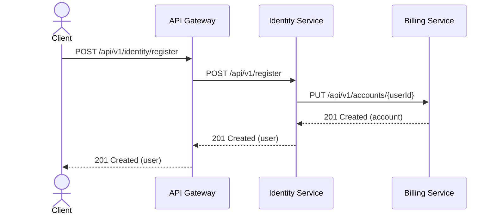
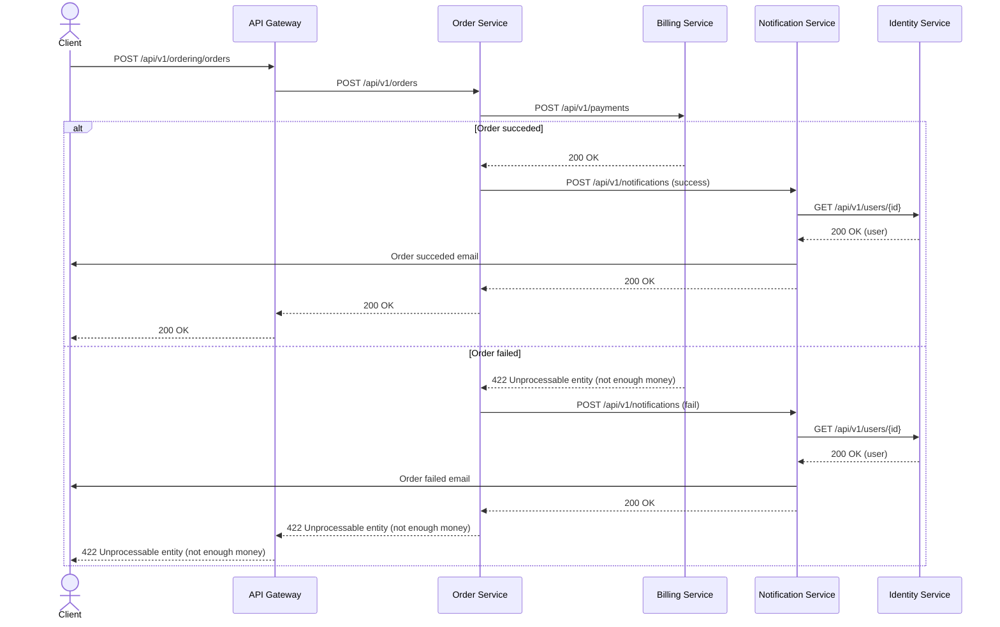
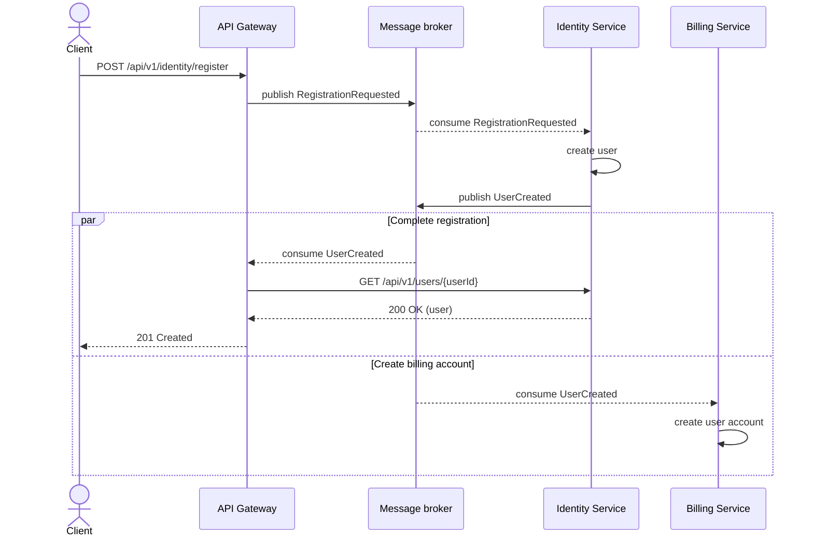
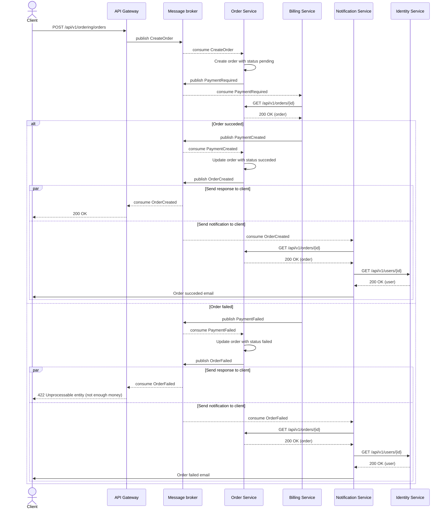
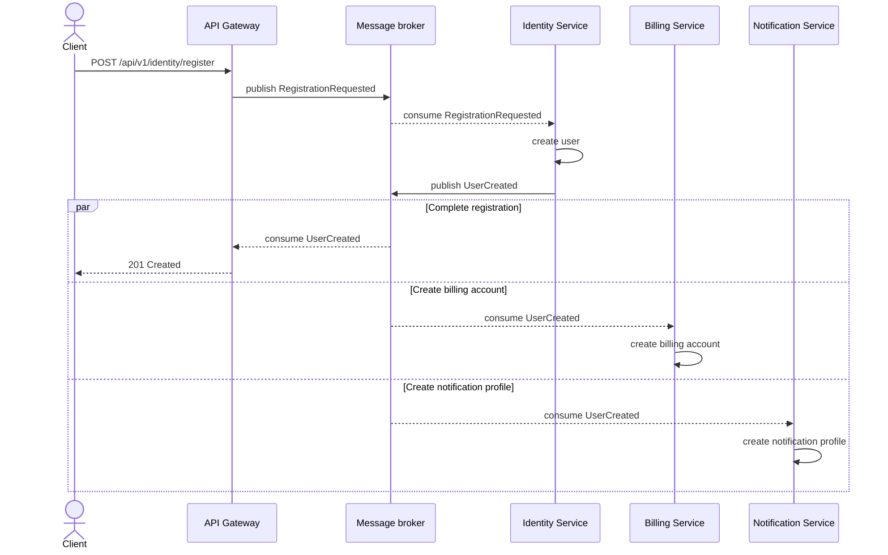
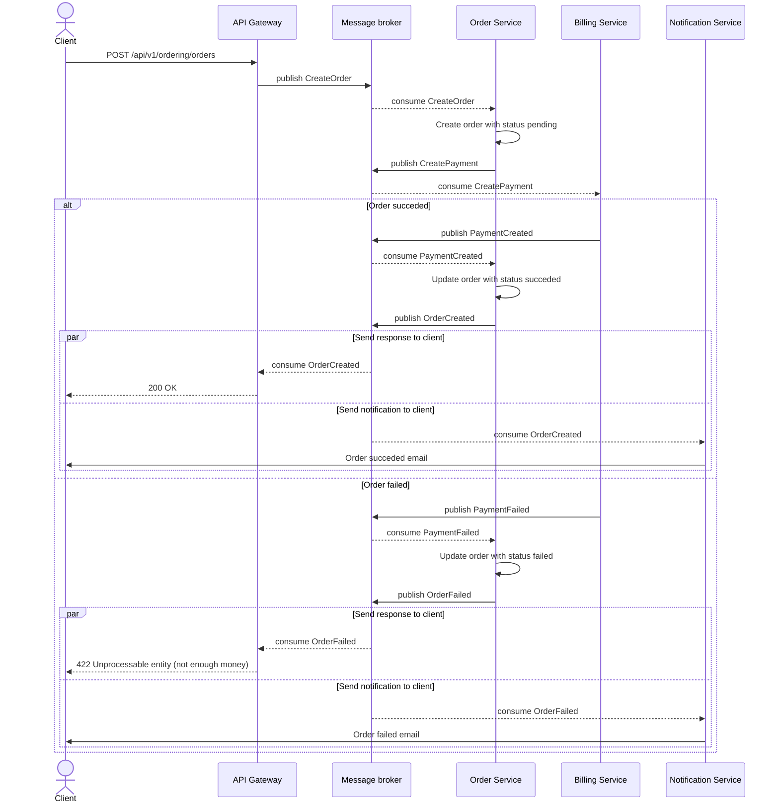
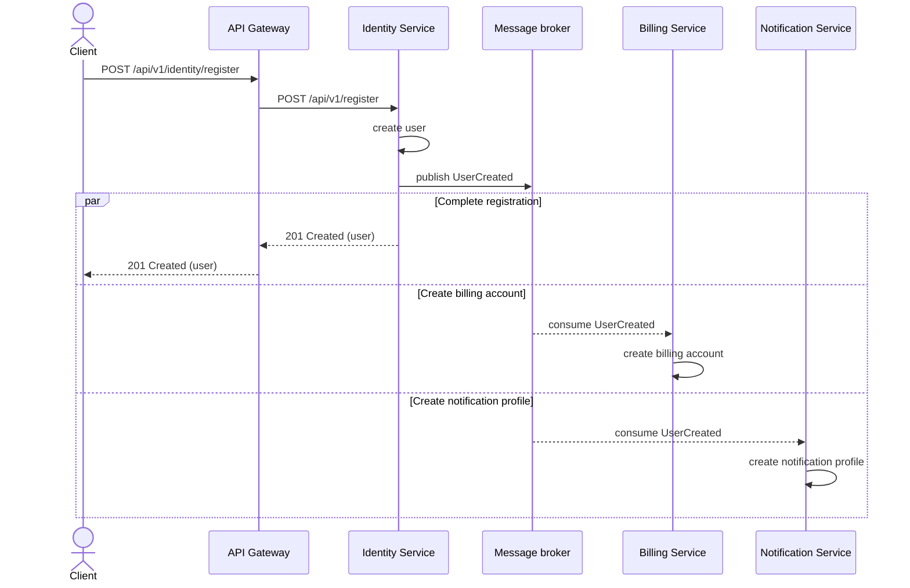
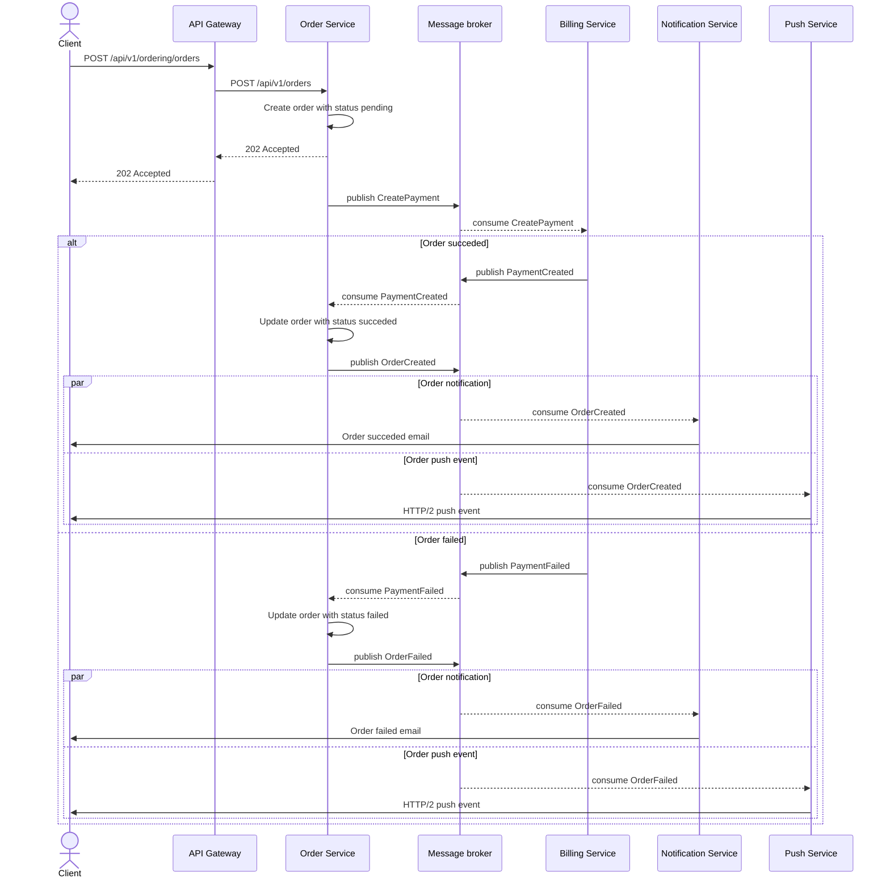

# Варианты реализации системы заказов

[Спецификация публичного REST API](public-api.yaml)

## 1. Взаимодействие через HTTP

### Спецификации

* [Спецификация REST API сервисов](1_http/rest-api.yaml)

### Регистрация пользователя

### Создание заказа

### Выводы

Достоинства:

* простота реализации;
* пользователь узнает о результате операции сразу (синхронное взаимодействие).

Недостатки:

* большое время ответа из-за синхронного взаимодействия между сервисами;
* асинхронные операции (отправка уведомлений) выполняются синхронно;
* необходим механизм оркестрации из-за распределенности обработки.

## 2. Событийные взаимодействия

### Спецификации

* [Спецификация REST API сервисов](2_events/rest-api.yaml)
* [Спецификация Async API сервисов](2_events/async-api.yaml)

### Регистрация пользователя

### Создание заказа

### Выводы

Достоинства:

* service discovery на основе брокера сообщений => легче масштабирование;
* создание аккаунта в биллинге осуществляется асинхронно;
* отправка уведомлений осуществляется асинхронно (параллельно с ответом в API Gateway).

Недостатки:

* повышенная сложность реализации: 
  * логика работы с брокером в API Gateway;
  * присутствуют синхронные запросы между сервисами;
  * API Gateway должен хранить состояние (correlationId).
* дополнительная связность между сервисами (биллинг обращается к заказам);
* увеличенное время ответа из-за дополнительного взаимодействия через брокер сообщений;
* проблемы асинхронного создания аккаунта в биллинге:
  * может возникнуть проблема отсутствия аккаунта в случае сбоя;
  * критично время выполнения события (аккаунта еще может не быть, когда он уже может быть нужен - маловероятно, но возможно).

## 3. Event collaboration

### Спецификации

* [Спецификация REST API сервисов](3_event-collaboration/rest-api.yaml)
* [Спецификация Async API сервисов](3_event-collaboration/async-api.yaml)

### Регистрация пользователя

### Создание заказа

### Выводы

Достоинства:

* service discovery на основе брокера сообщений => легче масштабирование;
* нет API вызовов между сервисами;
* создание аккаунта в биллинге осуществляется асинхронно;
* отправка уведомлений осуществляется асинхронно (параллельно с ответом в API Gateway).
* низкая связность между сервисами (биллинг ничего не знает о сервисе заказов);

Недостатки:

* повышенная сложность реализации:
  * логика работы с брокером в API Gateway;
  * API Gateway должен хранить состояние (correlationId).
* проблемы асинхронного создания аккаунта в биллинге:
  * может возникнуть проблема отсутствия аккаунта в случае сбоя;
  * критично время выполнения события (аккаунта еще может не быть, когда он уже может быть нужен - маловероятно, но возможно).
* сервисы должны хранить состояние из других областей (например, сервис уведомлений хранит копию сведений о пользователе).

## 4. Гибридный вариант

### Спецификации

* [Спецификация REST API сервисов](4_hybrid/rest-api.yaml)
* [Спецификация Async API сервисов](4_hybrid/async-api.yaml)

### Регистрация пользователя

### Создание заказа

### Выводы

Достоинства

* баланс между производительностью и простотой:
  * API Gateway выполняет роль proxy и не работает с брокером сообщений;
  * ответственность за асинхронность операций лежит на самих сервисах:
    * простые операции можно делать в синхронном стиле (пополнение/снятие средств с аккаунта в биллинге);
    * сложные операции в асинхронном (регистрация, оформление заказа).
* API создания заказа работает асинхронно с клиентом. Ожидание операции можно реализовать двумя путями:
  * через поллинг GET /api/v1/orders/{orderId};
  * через HTTP/2 push event или веб-сокеты.
* отсутствует необходимость хранения состояния (correlationId);
* низкая связанность между сервисами:
  * платежи ничего не знают о том, кто их инициировал (сервис заказов или другой);
  * платеж может создать любой сервис, а не только сервис заказов.

Недостатки:

* проблемы асинхронного создания аккаунта в биллинге и сервисе уведомлений:
  * может возникнуть проблема отсутствия аккаунта в случае сбоя;
  * критично время выполнения события (аккаунта еще может не быть, когда он уже может быть нужен - маловероятно, но возможно).
* сервисы должны хранить состояние из других областей (например, сервис уведомлений хранит копию сведений о пользователе).
