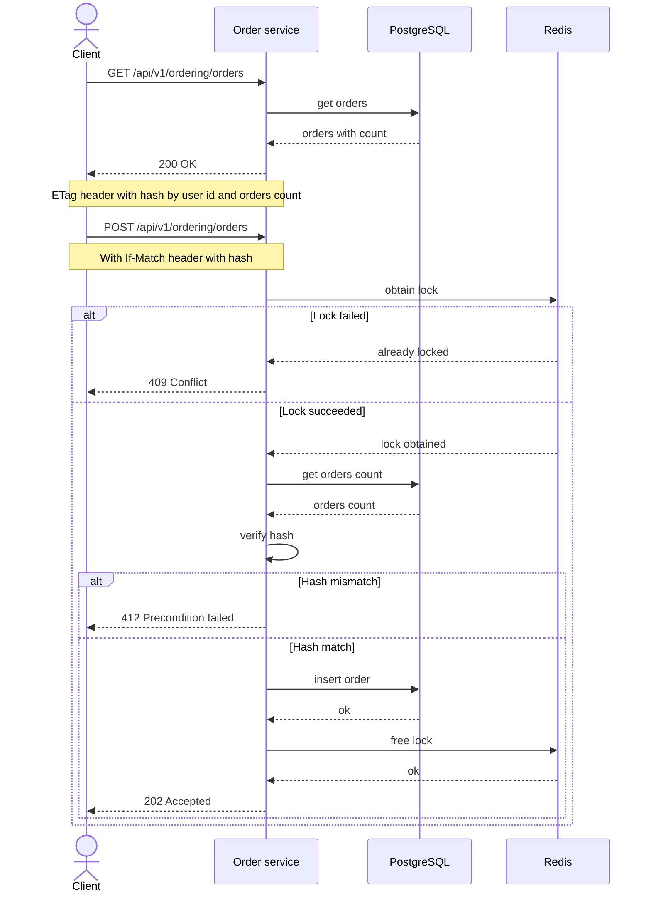

# Алгоритм идемпотентности для метода создания заказа

```mermaid
sequenceDiagram
    actor Client
    
    Client->>Order service: GET /api/v1/ordering/orders
    Order service->>PostgreSQL: get orders
    PostgreSQL-->>Order service: orders with count
    Order service-->>Client: 200 OK
    Note over Order service, Client: ETag header with hash by user id and orders count
    Client->>Order service: POST /api/v1/ordering/orders
    Note over Order service, Client: With If-Match header with hash
    Order service->>Redis: obtain lock
    alt Lock failed
        Redis-->>Order service: already locked
        Order service-->>Client: 409 Conflict
    else Lock succeeded
        Redis-->>Order service: lock obtained
        Order service->>PostgreSQL: get orders count
        PostgreSQL-->>Order service: orders count
        Order service->>Order service: verify hash
        alt Hash mismatch
            Order service-->>Client: 412 Precondition failed
        else Hash match
            Order service->>PostgreSQL: insert order
            PostgreSQL-->>Order service: ok
            Order service->>Redis: free lock
            Redis-->>Order service: ok
            Order service-->>Client: 202 Accepted
        end
    end
```
